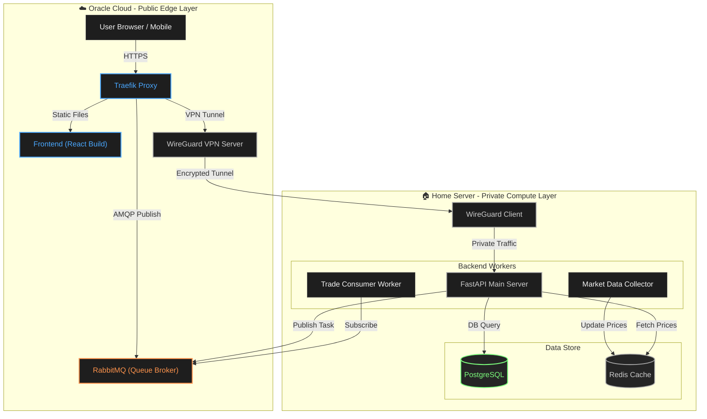

> 한 줄 요약: 국장(KRX), 미장(US), 코인(Crypto)을 모두 아우르는 24시간 하이브리드 모의투자 플랫폼
> 

[폴더 구조](https://www.notion.so/2b6b7fcfb36f80bca19cc15811d471b0?pvs=21)

[DB](https://www.notion.so/DB-2b6b7fcfb36f809b9d6dfbcc2d014252?pvs=21)

## 1. 아키텍처 (System Architecture)

**핵심 전략:** OCI는 "대문 및 우체통", 홈서버는 "공장 및 금고" 역할을 수행. 집 인터넷이 끊겨도 주문은 받아둔다.

## 2. 핵심 그라운드 룰 (Conventions) 💡

> 프로젝트 시작 전 절대 타협하지 않는 4가지 원칙
> 
1. **💰 돈 (Money):**
    - **DB:** `DECIMAL(20, 8)` 사용. `FLOAT` 절대 금지.
    - **기준 통화:** 모든 자산 가치 평가(Ranking)는 **KRW(원화)** 기준.
    - **저장:** 매수 당시의 원본 통화(USD/BTC)와 환율 정보를 같이 저장.
2. **⏰ 시간 (Time):**
    - **Server/DB:** 무조건 **UTC** 저장.
    - **Client:** 브라우저 로컬 타임존(KST)으로 변환하여 표시.
3. **🆔 식별자 (ID):**
    - 포맷: `[MARKET]-[TYPE]-[SYMBOL]` (All Caps)
    - 예시: `KRX-STOCK-005930`, `US-STOCK-AAPL`, `CRYPTO-COIN-BTC`
4. **🔄 통신 (Network):**
    - 주문(Order)은 **비동기(Event-Driven)** 처리. (OCI RabbitMQ에 넣고 끝)
    - 홈서버 인터넷 단절 시에도 OCI가 주문을 수집하여 유실 방지.

## 3. 기술 스택 (Tech Stack)

| **구분** | **기술** | **비고** |
| --- | --- | --- |
| **Infra** | Docker, OCI, Home Server | Hybrid Cloud |
| **Network** | Traefik, WireGuard | Reverse Proxy & VPN Tunneling |
| **Frontend** | React (Vite), TradingView Charts | OCI 호스팅 (S3 or Nginx) |
| **Backend** | Python FastAPI | 홈서버 구동 |
| **Database** | PostgreSQL 15+ | JSONB 및 Numeric 지원 필수 |
| **Cache/MQ** | Redis, RabbitMQ | 시세 캐싱 / 주문 대기열 |
| **Data API** | KIS(한투), ccxt(코인) | 데이터 수집용 |

## 4. 데이터베이스 설계 (Schema) 🗄️

### 4.1 Users (사용자)

- **id:** `UUID` (PK)
- **username:** `VARCHAR` (로그인 ID)
- **nickname:** `VARCHAR` (랭킹 표시용)
- **role:** `ENUM('ADMIN', 'USER')`

### 4.2 Wallets (현금 지갑)

- **user_id:** `UUID` (FK)
- **balance_krw:** `DECIMAL(20, 8)` (현재 보유 원화)
- **last_updated:** `TIMESTAMP WITH TIME ZONE`

### 4.3 Portfolios (보유 주식)

- **id:** `BIGINT` (PK)
- **user_id:** `UUID` (FK)
- **ticker_id:** `VARCHAR` (예: US-STOCK-AAPL)
- **quantity:** `DECIMAL(20, 8)` (보유 수량, 코인은 소수점 가능)
- **average_price:** `DECIMAL(20, 8)` (평단가 - 해당 통화 기준)
- **currency:** `VARCHAR(5)` (USD, KRW, KRW-COIN)

### 4.4 Orders (주문 내역 - Log)

- **id:** `UUID` (PK)
- **user_id:** `UUID` (FK)
- **ticker_id:** `VARCHAR`
- **side:** `ENUM('BUY', 'SELL')`
- **type:** `ENUM('MARKET', 'LIMIT')` (초기는 MARKET만 구현)
- **status:** `ENUM('PENDING', 'FILLED', 'CANCELLED', 'FAILED')`
- **price:** `DECIMAL` (체결 가격)
- **quantity:** `DECIMAL` (체결 수량)
- **applied_exchange_rate:** `DECIMAL` (체결 당시 환율)
- **created_at:** `TIMESTAMP` (주문 시간)
- **filled_at:** `TIMESTAMP` (체결 시간)

## 5. 상세 기능 명세 (Specs)

### 🧩 Module A: Market Data Feeder (정보 수집기)

- **위치:** 홈서버
- **역할:** 1초마다 외부 API를 찔러서 현재가를 가져옴.
- **로직:**
    1. `ccxt` (Coin) & `KIS API` (Stock) 비동기 호출.
    2. 가져온 데이터를 표준 JSON으로 변환.
    3. **Redis** 키 `price:{TICKER_ID}` 에 덮어쓰기 (TTL 5초).
    4. Redis Pub/Sub 채널 `market_updates`에 발행 (웹소켓용).

### 🧩 Module B: Trade Engine (체결 엔진)

- **위치:** 홈서버 (Background Worker)
- **역할:** RabbitMQ 큐를 바라보다가 주문이 들어오면 처리.
- **로직:**
    1. Queue에서 메시지 Pop (`{user_id, ticker, action, amount}`).
    2. Redis에서 현재가 조회 (`price:{ticker}`).
    3. 유효성 검사 (장 운영 시간인가? 잔고는 충분한가?).
    4. **Transaction Start:**
        - Wallet 잔고 차감/증가.
        - Portfolio 수량 변경/평단가 재계산.
        - Order 상태 `FILLED`로 업데이트.
    5. **Transaction Commit.**
    6. 실패 시 Order 상태 `FAILED` 처리 및 알림.

### 🧩 Module C: Gateway & Auth (API 서버)

- **위치:** 홈서버 (FastAPI) -> OCI Traefik을 통해 노출
- **역할:** 프론트엔드 요청 처리.
- **기능:**
    - `POST /auth/login`: JWT 토큰 발급.
    - `GET /portfolio`: 내 잔고 + 현재가 기반 평가금액 계산 리턴.
    - `POST /order`: 주문 요청 -> RabbitMQ에 Push 하고 즉시 `202 Accepted` 리턴.

## 6. 개발 마일스톤 (Roadmap) 🚩

- **Phase 1: 인프라 구축 (이번 주말)**
    - [x]  OCI에 RabbitMQ, WireGuard 설치.
    - [x]  홈서버 DB(PostgreSQL), Redis 세팅.
    - [ ]  VPN 연결 테스트 (홈서버에서 OCI RabbitMQ 접속 확인).
    - [x]  CI/CD 파이프라인 구축
- **Phase 2: "비트코인을 사보자" (Backend Core)**
    - [ ]  DB 테이블 생성 (SQL 작성).
    - [ ]  `ccxt`로 비트코인 가격 수집기 작성.
    - [ ]  매수 주문 API -> RabbitMQ -> Worker -> DB 반영 로직 구현.
- **Phase 3: 눈에 보이는 것 (Frontend Basic)**
    - [ ]  React 프로젝트 생성.
    - [ ]  로그인 페이지 & 내 자산 조회 페이지.
    - [ ]  간단한 매수/매도 버튼 구현.
- **Phase 4: 확장 (Stock & Realtime)**
    - [ ]  KIS(한투) API 연동 (국장/미장).
    - [ ]  웹소켓 연결 (실시간 가격 변동 반영).
    - [ ]  환율 계산 로직 적용.
- **Phase 5: 배포 및 안정화**
    - [ ]  OCI에 Frontend 빌드 파일 배포.
    - [ ]  Discord 알림 봇 연동.
    - [ ]  친구들 초대 및 버그 사냥.