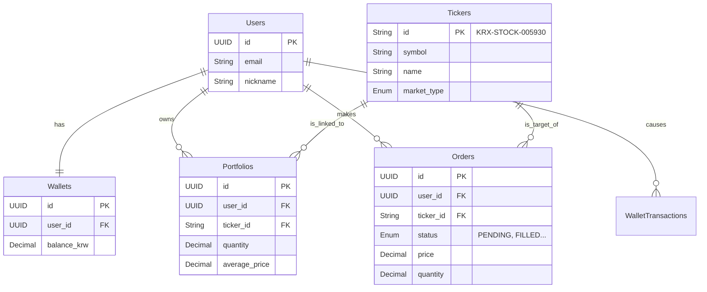

# ER Table

```mermaid
erDiagram
    Users ||--|| Wallets : has
    Users ||--o{ Portfolios : owns
    Users ||--o{ Orders : makes
    Users ||--o{ WalletTransactions : causes
    
    Tickers ||--o{ Portfolios : is_linked_to
    Tickers ||--o{ Orders : is_target_of

    Users {
        UUID id PK
        String email
        String nickname
    }

    Wallets {
        UUID id PK
        UUID user_id FK
        Decimal balance_krw
    }

    Tickers {
        String id PK "KRX-STOCK-005930"
        String symbol
        String name
        Enum market_type
    }

    Portfolios {
        UUID id PK
        UUID user_id FK
        String ticker_id FK
        Decimal quantity
        Decimal average_price
    }

    Orders {
        UUID id PK
        UUID user_id FK
        String ticker_id FK
        Enum status "PENDING, FILLED..."
        Decimal price
        Decimal quantity
    }
```